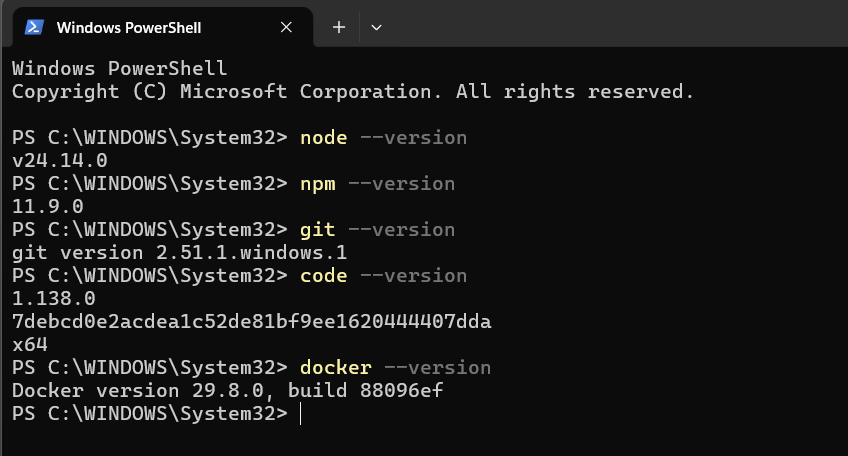
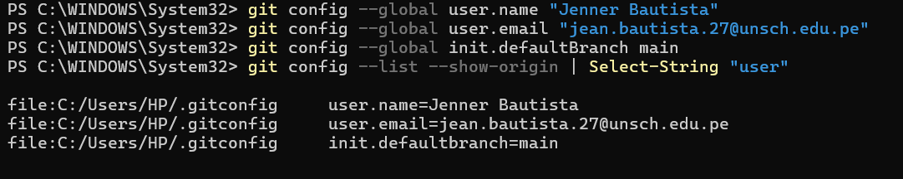

# Guía 01 - Arquitectura de Software

## Datos del estudiante

**Nombre:** Jenner Bautista Figueroa

## Descripción del curso

Curso orientado al aprendizaje de conceptos, principios,
herramientas y buenas prácticas relacionadas con la arquitectura
de software.

## Expectativas del curso

Espero fortalecer mis conocimientos sobre arquitectura de software,
diseño de sistemas, buenas prácticas de desarrollo y herramientas
utilizadas en proyectos de software.

## Docente

**Docente:** [Nombre del docente]

## Evidencias

### Paso 1

### Paso 2

